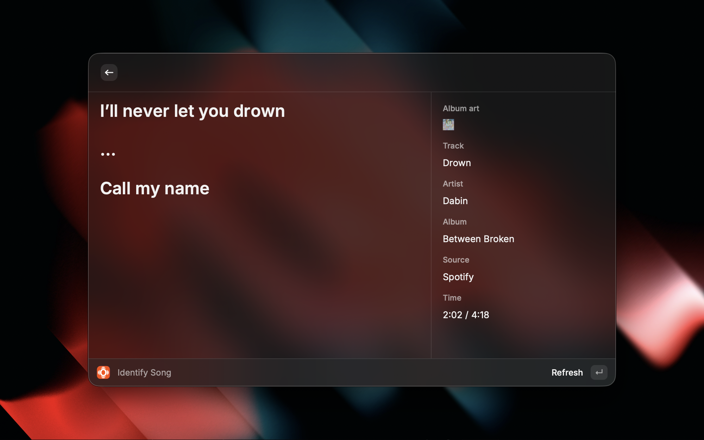
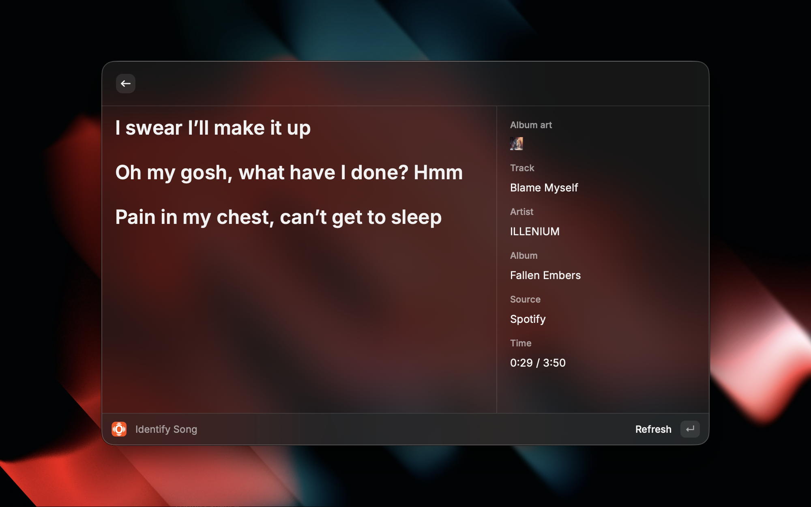
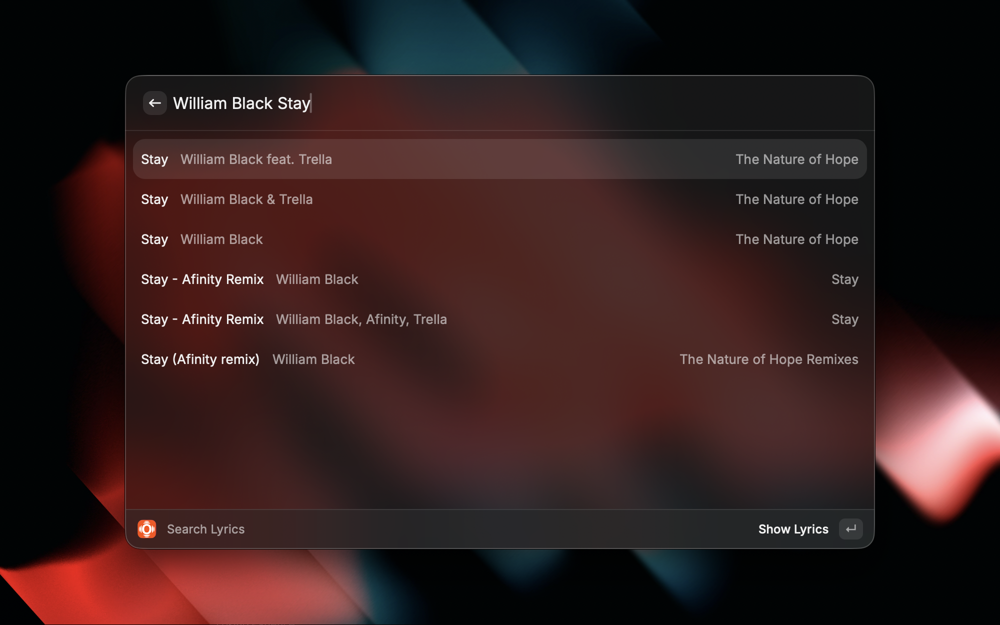

# Open Lyrics

A Raycast extension for real-time lyric syncing and search, powered by [LRCLIB](https://lrclib.net/).

## Features

### 🎵 Identify Song
Automatically detects the currently playing song on **Spotify** or **Apple Music** and displays synchronized lyrics in real-time.

- **Real-time sync**: Lyrics are automatically scrolled as the song plays
- **Seek detection**: Jump to any part of the song and lyrics follow instantly
- **Track metadata**: View song details including artist, album, source, and playback time

### 🔍 Search Lyrics
Manually search for lyrics by song name when you're not actively listening to music.

- **Fast search**: Quickly find lyrics for any song
- **Comprehensive results**: Search across a vast library of songs
- **Full lyrics display**: View complete lyrics with metadata

## Installation

### From Raycast Store
1. Open Raycast
2. Search for "Open Lyrics"
3. Click Install

## Usage

### Identify Song
1. Start playing a song on Spotify or Apple Music
2. Open Raycast and search for "Identify Song"
3. Lyrics will automatically sync with the currently playing track
4. Use `Cmd+R` to manually refresh if needed

### Search Lyrics
1. Open Raycast and search for "Search Lyrics"
2. Type the song name or artist
3. Select a song from the results to view its lyrics

## Data Source

All lyrics are provided by [LRCLIB](https://lrclib.net/), a free, open-source lyrics database. LRCLIB provides:
- Time-synced lyrics (LRC format)
- Plain text lyrics as fallback
- Community-contributed content

## Contributing

Contributions are welcome! Please feel free to submit a Pull Request.

## License

MIT

## Credits

- Lyrics provided by [LRCLIB](https://lrclib.net/)
- Built with [Raycast API](https://developers.raycast.com/)

---

Made with ❤️ for music lovers